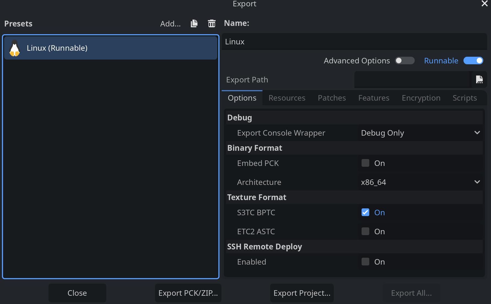
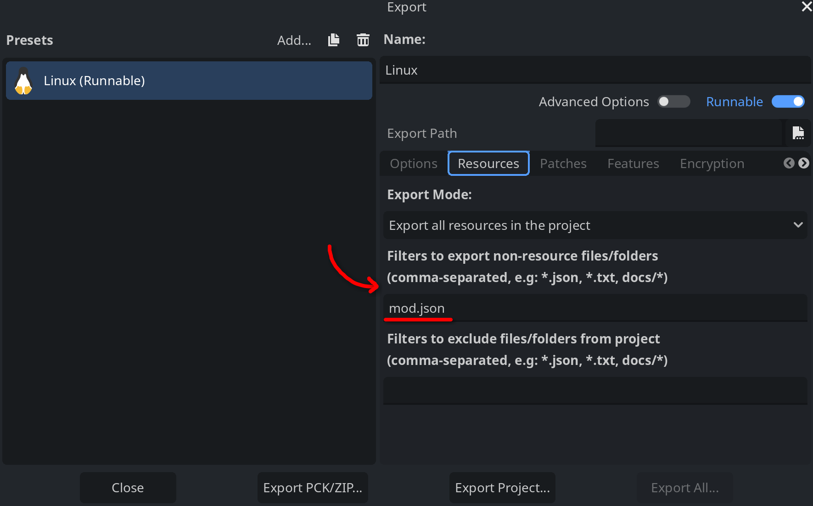
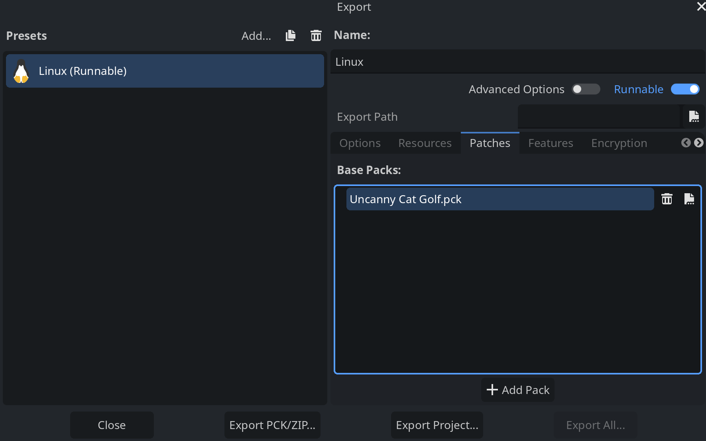
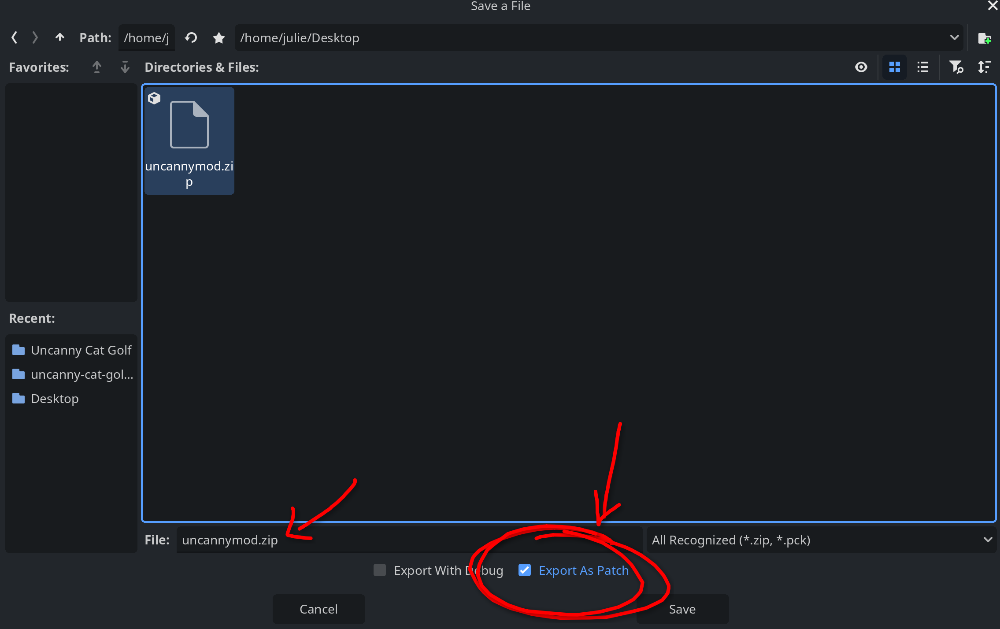

When you are done making your changes, you'll want to export your mod so others can try it! The process shouldn't be too difficult.

To start, navigate to the export dialog in Godot. This is reached by going to `Project > Export...` in the top bar.

You'll need to add presets. Any of them will do as we aren't making an executable file; the Windows one will work fine if you are on Linux, etc. 

:::note
You will probably need to download the export templates which will take a couple of minutes or so depending on your internet speed. These are necessary for exporting.
:::

The screen should look something like this now:

Navigate to the `Resources` tab and add `mod.json` to the field `Filters to export non-resource files/folders`:

Now, go to the `Patches` tab, press Add Pack, and locate the `Uncanny Cat Golf.pck` file that is in the game directory (see [here](decomp) if you are confused). Select it. The window should now look like this:

Then you can press on the button labeled `Export PCK/ZIP...` and find a good directory for where you'll keep it stored. Before you press the Export button, make sure that "Export As Patch" is enabled at the bottom so that it's only your changes, not the entire game. Name the file `mycoolmod.zip`. Then just press the save button, and your mod is exported!

Now you can distribute your mod wherever you want! See [Installing Mods](../guides/installing) for how you can install it into the game.

:::note
Changing translations is not currently supported. We're working on it
:::
