This guide will show you how to construct any logo mimicking the style of the original Uncanny Cat Golf logo, shown below:

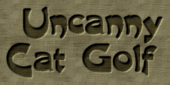

:::note
If you want to create a logo with normal text, use the following site instead: [Embossed Logo Generator](https://cooltext.com/Logo-Design-Embossed)

This is how the original logo (and many other assets of the game, from the site's other tools) was created. This guide is only necessary if the symbols you want don't work with the generator or you are designing other non-text patterns.
:::

## Creating the base texture

First, we'll go to [Photopea](https://www.photopea.com/). Other image software such as Photoshop may work as well, but this tutorial is for this site specifically as it is free to use.

To start, tile this texture (you can just repeatedly paste & move) until it's as large as you need to fit your logo:

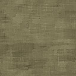

Here is an example:

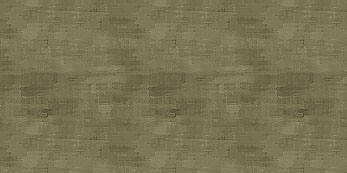

<small>*(Hint: the original logo is 347 x 173)*</small>

Once you have the background done, create a new layer on the right (if you don't see the layers, there is a toggle on the right bar). Select it, then at the top of the screen go to **Layer > Layer Style > Blending Options** and set the `opacity` to 61%.

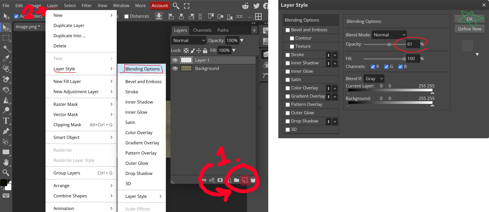

After that, set your pen color in the lower left to `#0d0c00` and draw the logo you want in this layer. You can do this part in a different image software with the same color and copy it in, instead, if you want.

Here's mine:

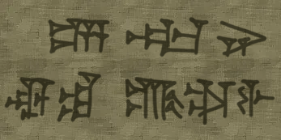

## Adding the embossed effect

Once you have your logo how you want it, you are ready to add the rest of the effects! First, we'll duplicate this layer on the right to have a base to create the shadows later. After you've done that, we can start creating the light part of the embossing. Go to **Layer > Layer Style > Bevel and Emboss** and use the following settings:

* **Style:** Outer Bevel
* **Technique:** Chisel Hard, Down
* **Depth:** 284%
* **Size:** 4
* **Soften:** 5
* **Angle:** 135°, 5°
* **Mode:** Screen, `#fff7a9`
* **Opacity (first):** 87%
* **Opacity (second):** 0%

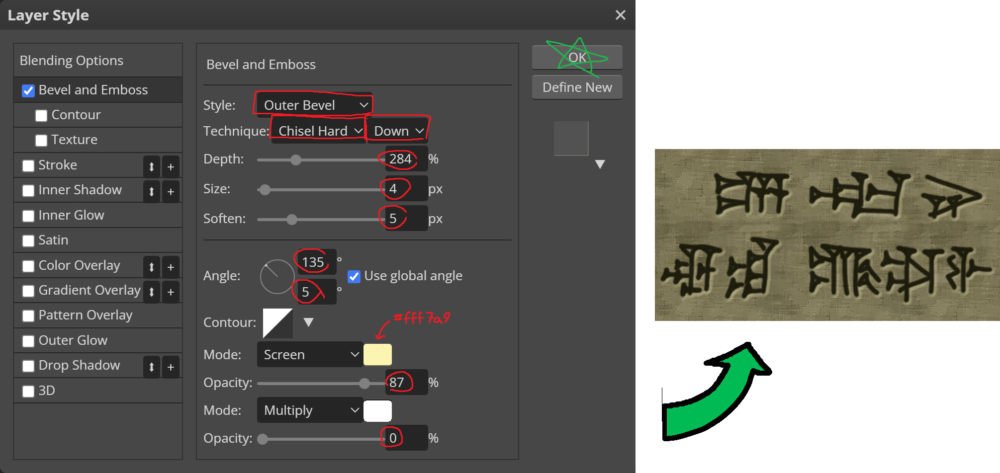

If all looks good, hide this layer and go to the copy we made before. Now we'll move onto the shadows.

## Casting the shadows

This layer we want pretty much fully opaque but still be able to see what we're doing, so let's go back to **Layer > Layer Style > Blending Options** and set the `opacity` to 90% this time.

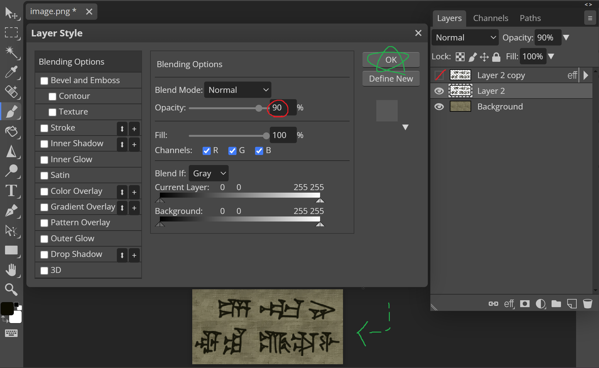

Next, to add the shadows, go to **Layer > Layer Style > Inner Shadow** and plug in these settings:

* **Opacity:** 100%
* **Distance:** 4
* **Spread:** 0
* **Size:** 5
* **Contour:**
  * **X (in):** 30
  * **Y (out):** 100

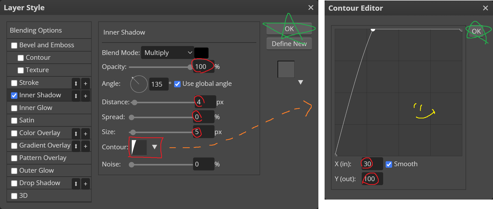

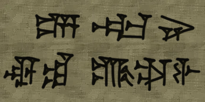

<small>*Very hard to see the difference.*</small>

## Finishing up

The layer effects we created are visible but not fully applied. To save the results back to the layers, right-click on each layer and click `Rasterize Layer Style` - do so for both the shadows layer and the highlights layer. The background tiled-texture layer has no effects so it's not necessary to do it there.

If we show both layers the result is pretty dark since they both have the design. This is the tricky part, but we will trim it from the shadows layer. With the shadows layer still shown and the highlights layer hidden, select the wand tool on the left and set `tolerance` at the top to 8. Make sure that `contiguous` is off and also that the correct layer is selected. Now, find any part of the logo pattern that is *not* covered by shadow. It should be somewhat lighter than the shadowed parts (you can zoom in with alt + scroll). Click one of these areas and it should select all of the unshadowed parts of the pattern. If you can't get this to work, make sure you rasterized the layer styles and try lowering the tolerance.

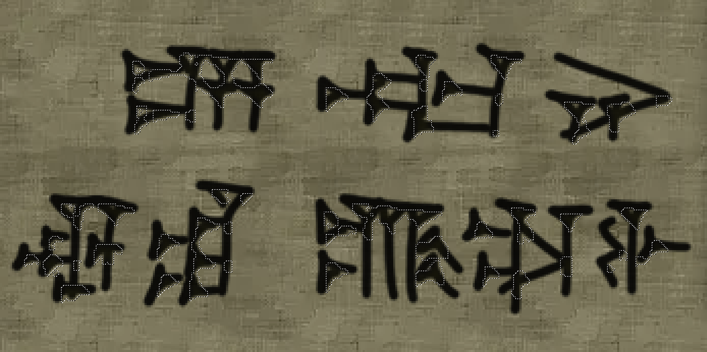

With all the unshadowed parts selected, you can safely delete the entire selection.

This removed the unshadowed parts from this layer, but the result is rather 
ugly. We'll fix this while also simulating the dark edges of the embossment. Do the following twice: **Filter > Blur > Blur More**. The result should look like this:

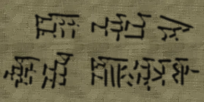

This will round the edges and also provide a shadowed overlay where the dark edges of the embossment would be.

It's time to view our creation! Unhide all the layers and witness the beautiful bootleg uncanny cat golf logo. In order to actually use the texture, right-click any layer and select `Flatten Image`. Now you can copy or save the result.

You're done!

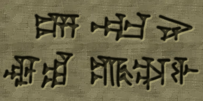

<small>*Ancient Mesopotamia Adventure!!!*</small>
