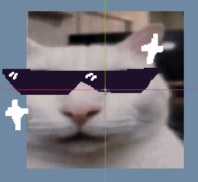
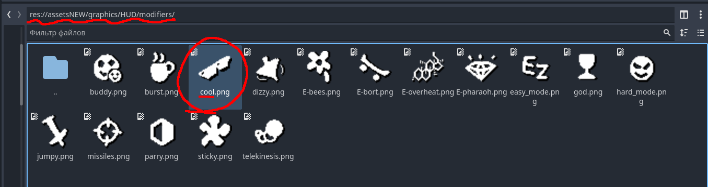
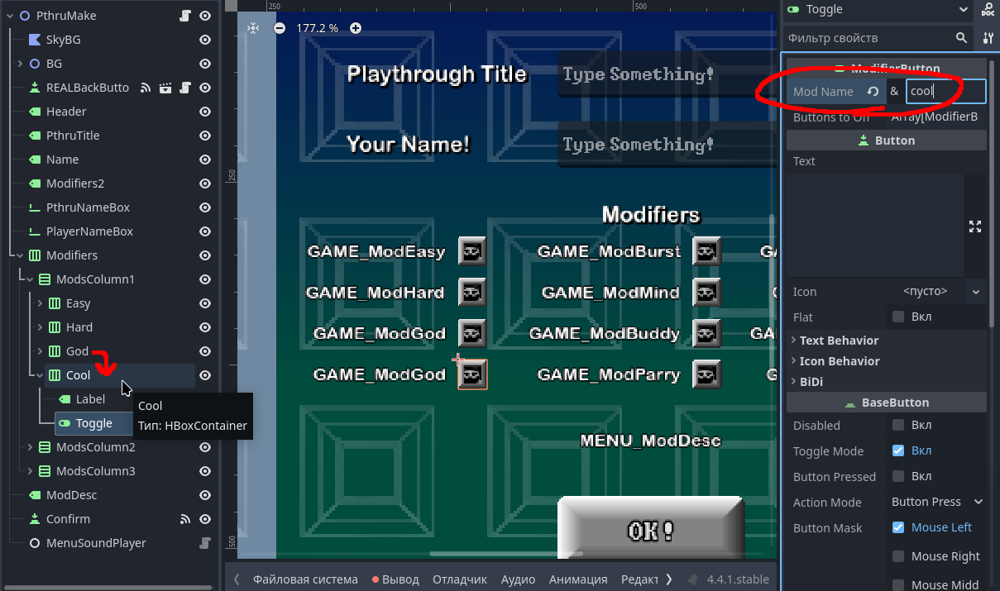
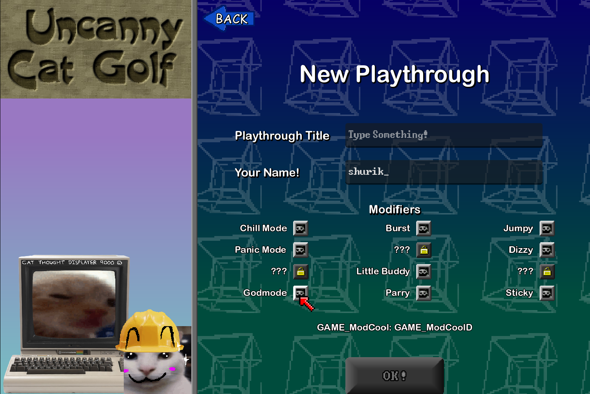
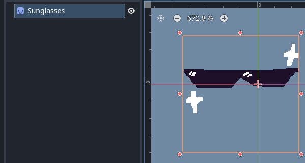
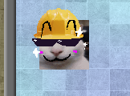

Making a new modifier is relatively simple!
In this guide, we will create a simple modifier that adds a new Sprite2D to the player.




:::note
This guide assumes that you:
 1. have some basic understanding of GDScript, signals, and the scene tree.
 2. know [mod script basics](/guides/modscript_basics/).
 3. have the UCG project ready and open in Godot. If not, [do it beforehand](/getting-started/).
:::


## Adding the basics

All modifiers are stored in `res://assetsNEW/scenes/utils/modifiers.gd` as a dictionary. To add a new one, just add a new key at the end of the dictionary.

```gd
extends Resource
class_name Modifiers

# These variables are, like, useless. They do absolutely nothing!
var easy_mode: = false
var hard_mode: = false
var burst: = false
var telekinesis: = false
var glass: = false
var buddy: = false
var gun: = false
var parry: = false
var hypercam: = false


var mods: Dictionary = {
	"easy_mode" = false, 
	"hard_mode" = false, 
	"burst" = false, 
	"telekinesis" = false, 
	"buddy" = false, 
	"parry" = false, 
	"jumpy" = false, 
	"dizzy" = false, 
	"missiles" = false, 
	"E-pharaoh" = false, 
	"E-bort" = false, 
	"sticky" = false, 
	"E-bees" = false, 
	"E-overheat" = false, 
	"god" = false, 
	"test" = false, 
	"cool" = false, # <-- that's our new modifier!
}

```


### Icon



All modifier icons are stored in `res://assetsNEW/graphics/HUD/modifiers/` and loaded in automatically. Just drop your icon in there and everything will be fine!

:::caution
The modifier name and icon name should be **the same**.
:::


### Adding a new button to the playthrough screen

To play with our new modifier, we also need a new button to enable it.
Open `res://assetsNEW/scenes/game/menus/pthru/pthru_make.tscn` and duplicate one of the toggle buttons in the columns.
Set "Mod name" to the name you added earlier in `modifiers.gd`.



Of course, you could just leave it there and override the scene, but that's not really the right solution and could cause more conflicts with other mods.

Instead of overriding it, we will patch the playthrough screen using [node interception](/guides/modscript_basics/#going-deeper).

Make the button a separate scene, and then remove it from `pthru_make`.


Now, let's search for a node with the `PthruMake` class in our mod script:

```gd
extends Node


func _enter_tree() -> void:
	var master:Master = get_tree().current_scene
	
	if master:
		master.child_entered_tree.connect(new_child_in_master)


func new_child_in_master(child: Node) -> void:
	if child is PthruMake:
		var column:BoxContainer = child.get_node("Modifiers/ModsColumn1") # We will be adding button to the first column
        
		# Write your own path to the button scene in the preload function.
		var cool_mod_btn = preload("res://mods/cool/cool_modifier_btn.tscn").instantiate()
		var toggle_btn:Button = cool_mod_btn.get_node("Toggle") # The REAL button
		
		column.add_child(cool_mod_btn)
		
		
		# Because the button will be disabled in the _ready function (because the save file doesn't contain unlock info about it),
		# we will connect a signal to enable it again.
		# The signal emits after the _ready function.
		
		toggle_btn.ready.connect(func():
			toggle_btn.disabled = false
		)

```

Let's test it!



Here it is! But it kinda lacks a name and description.
Go to your button scene, and change label text to `GAME_Mod[mod name]`. Replace `[mod name]` with your modifier name from earlier.
Now, let's add new translation keys in our mod script:
```gd
func _init() -> void:
	var translation := Translation.new()
	translation.locale = "en"
	translation.add_message(
		StringName("GAME_ModCool"), # Replace "Cool" with your modifier name.
		StringName("Cool mode") # Title
	)
	translation.add_message(
		StringName("GAME_ModCoolD"), # Ditto, but leave D at the end.
		StringName("Gives Canny cool sunglasses.") # Description
	)

	TranslationServer.add_translation(translation)
```
:::note
TODO: add a link to the future guide on how to add new translation keys.
:::


## Adding new stuff

So, now our modifier is finally in the game, but when starting a new playthrough with it, nothing happens!
Let's spy on the player and check if modifier is enabled:

```gd
func new_child_in_master(child: Node) -> void:
	if child is GameScene:
		child.child_entered_tree.connect(new_child_in_pthru)
	
	# <...>

func new_child_in_pthru(child: Node) -> void:
	if not child is Level:
		return
	var plr
	plr = child.find_child("Player") # In some levels, the player can be inside another player node.
	if plr is Node2D: 
		plr = plr.get_node("Player")
		
	if plr is Player:
		print("found player!")
		await plr.ready # Waiting for the player's _ready just to be safe!
		var is_active:bool = plr.mod_active("cool")
		print("Is cool mode active? ",is_active)

```

With that, we can now basically do anything with the player if the modifier is enabled.

Let's create a new scene that contains sunglasses, and save it somewhere.



Create a new child if the modifier is enabled:
```gd
func new_child_in_pthru(child: Node) -> void:
	if not child is Level:
		return
	var plr
	plr = child.find_child("Player") # In some levels, the player can be inside another player node.
	if plr is Node2D: 
		plr = plr.get_node("Player")
		
	if plr is Player:
		print("found player!")
		await plr.ready # Waiting for the player's _ready just to be safe!
		var is_active:bool = plr.mod_active("cool")
		print("Is cool mode active? ",is_active)
		
		if is_active:
			var sunglasses = preload("res://mods/cool/sunglasses.tscn").instantiate()
			plr.add_child(sunglasses)


```
Let's test it:


And that's it! Now, this is just a simple example of what modifiers can do. You can try adding a new state to the player, changing the level layout, changing the behavior of some scripts, and so on.


<details>
<summary>Full code</summary>

```gdscript

extends Node


func _init() -> void:
    var translation := Translation.new()
    translation.locale = "en"
    translation.add_message(
	    StringName("GAME_ModCool"),
	    StringName("Cool mode")
    )
    translation.add_message(
	    StringName("GAME_ModCoolD"),
	    StringName("Gives Canny cool sunglasses.")
    )
    TranslationServer.add_translation(translation)

func _enter_tree() -> void:
    var master:Master = get_tree().current_scene

    if master:
	    master.child_entered_tree.connect(new_child_in_master)


func new_child_in_master(child: Node) -> void:
    if child is GameScene:
	    child.child_entered_tree.connect(new_child_in_pthru)
    if child is PthruMake:
	    var column:BoxContainer = child.get_node("Modifiers/ModsColumn1") # We will be adding button to the first column

	    # Write your own path to the button scene in the preload function.
	    var cool_mod_btn = preload("res://mods/cool/cool_pthru_btn.tscn").instantiate()
	    var toggle_btn:Button = cool_mod_btn.get_node("Toggle") # The REAL button

	    column.add_child(cool_mod_btn)


	    # Because the button will be disabled in the _ready function (because the save file doesn't contain unlock info about it),
	    # we will connect a signal to enable it again.
	    # The signal emits after the _ready function.

	    toggle_btn.ready.connect(func():
		    toggle_btn.disabled = false
	    )

func new_child_in_pthru(child: Node) -> void:
    if not child is Level:
	    return
    var plr
    plr = child.find_child("Player") # In some levels, the player can be inside another player node.
    if plr is Node2D: 
	    plr = plr.get_node("Player")
	    
    if plr is Player:
	    print("found player!")
	    await plr.ready # Waiting for the player's _ready just to be safe!
	    var is_active:bool = plr.mod_active("cool")
	    print("Is cool mode active? ",is_active)
	    
	    if is_active:
		    var sunglasses = preload("res://mods/cool/sunglasses.tscn").instantiate()
		    plr.add_child(sunglasses)


```

</details>
