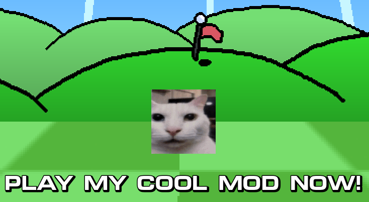

At first, you would probably think to mod UCG by overriding game assets, such as graphics, scenes, and scripts. This is effective, but prone to conflicts, especially with future game versions. To address that, UCG uses **mod scripts**, which are loaded with `*.zip` mods and provide a better way to change the game.

Technically, mod scripts are just `.gd` files that represent `Node` instances added to the `Master` scene. From there, you can access all the nodes in the game, including `PThru`, which contains the main gameplay.

:::note
This guide assumes that you:
 1. have some basic understanding of GDScript, signals, and the scene tree.
 2. have the UCG project ready and open in Godot. If not, [do it beforehand](/getting-started/).
:::

Here is a sample mod script (`testmod.gd`) with comments:

```gd
extends Node
# ^ That is critical, do not remove!

# called when the mod node is instantiated
# here you can do some behind the scenes setup
func _init() -> void :
	print("testmod: pre-initialization")

# called before Master's _enter_tree() function
# here you can modify Master as you need
func _enter_tree() -> void :
	print("testmod: main initialization")
	# obtaining the master node...
	master = get_tree().current_scene as Master 
	if master:
		print("testmod: painting the town red")
		# and modifying it
		master.modulate = Color.RED

# called after Master's initialization and before its _ready() function
# here you can make final preparations
func _ready() -> void :
	print("testmod: post-initialization")
```

As you can see, `master` is also a `Node` instance, so you can traverse the tree, connect signals, and modify child nodes and `master` itself, as in the example above.

## Quick Debug Tip

You will probably want to skip exporting your mod just to test it. One of the easiest ways to add your local mod with a little shim. 

Open `mod_loader.gd`, navigate to `_load_config()` and insert the line in the end of the function:

```gd

func _load_config() -> void :
	# ...
	# mind the real id value in mod.json
	enabled.append("fogwaves.testmod")

```

Just don't forget to remove it later when you are done.

## Node Interception 101

The first step is to connect the child enter signal so we can watch nodes being added:

```gd
func _enter_tree() -> void :
	# ...
	if master:
		# connect the signal
		master.child_entered_tree.connect("_on_child_added")

func _on_child_added(node : Node) -> void :
	# do something with the node
	print("testmod: child added: ", node.name)
```

Next, run the game, click some buttons, and look at the debug logs to see the node flow:

```
testmod: pre-initialization
testmod: main initialization
testmod: painting the town red
testmod: child added BG:<CanvasLayer#120175199645>
testmod: child added HUD:<CanvasLayer#120242309679>
testmod: child added HUDMods:<CanvasLayer#120493967799>
testmod: child added Music:<Node#145257140290>
testmod: child added SecretKeyAnim:<CanvasLayer#145877897319>
testmod: child added skeleton:<CanvasLayer#145961783404>
testmod: child added MenuSelect:<AudioStreamPlayer#145995337838>
testmod: child added MenuBack:<AudioStreamPlayer#146028892272>
testmod: post-initialization
testmod: child added GameLoader:<Node2D#182569669273>
testmod: child added TitleScreen:<Node2D#738767953836>
testmod: child added MainMenu:<Node2D#741301313482>
testmod: child added SettingsMenu:<Node2D#747039113557>
testmod: child added @Node2D@9:<Node2D#752307148351>
```

Now you can pin down the nodes you want to modify. Look them up in the Godot project and look for the node, its name and properties. 

For example, to change the text on the title screen:

```gd
func _on_child_added(node: Node):
	if node.name == "TitleScreen":
		var em := node.find_child("ClickPrompt") as CustomButton
		if em:
			em.text = "PLAY MY COOL MOD NOW!"
			print("testmod: patched the title prompt")
```

Run the game and see the result!



## Going deeper

The tricky part starts when you want to intercept nodes in the main gameplay. The `Master` node does not emit the tree enter signal for its own children. When you run the level, it instead spawns `PThru`, which is the main gameplay node. Then `PThru` loads level scenes, and it can't be seen from `Master`. 

So why not just connect to the `PThru` enter signal?

```gd
func _on_child_added(node: Node):
	# lock the target
	if node.name == "PThru":
		_PThru_start(node)

func _PThru_start(node: PThru):
	print("testmod: gameplay hai!")
	# bait the line
	pthru.child_entered_tree.connect(_PThru_on_child_added)

func _PThru_on_child_added(node: Node):
	# spread the net
	if node is Level:
		# catch the man
		print("testmod: new PThru level ", node)
	else:
		# ...or fish? 
		print("testmod: new PThru child ", node)
```

Once again, run the game and check the debug logs.

```
testmod: child added PthruSelect:<Node2D#683252128157>
testmod: child added LevelSelect:<Node2D#688704723044>
testmod: gameplay hai!
testmod: new PThru child PthruHUD:<CanvasLayer#734439415179>
testmod: new PThru child Sounds:<Node#734842067096>
testmod: new PThru level 0-1:<Node2D#734993061591>
```

Then you can take `node`, which is an instance of `Level`, and patch it in the same way or go even further.

:::note
TODO: add more details on `get_children`, adding your own nodes, replacing nodes, overriding scripts, etc.
:::
