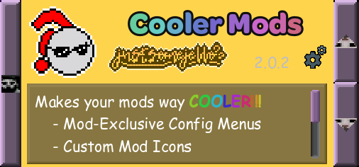
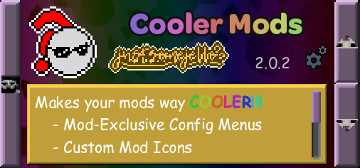
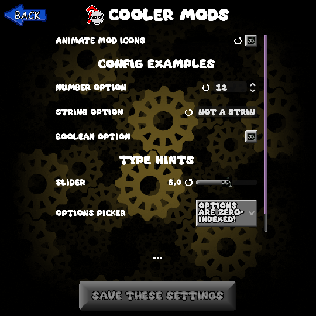
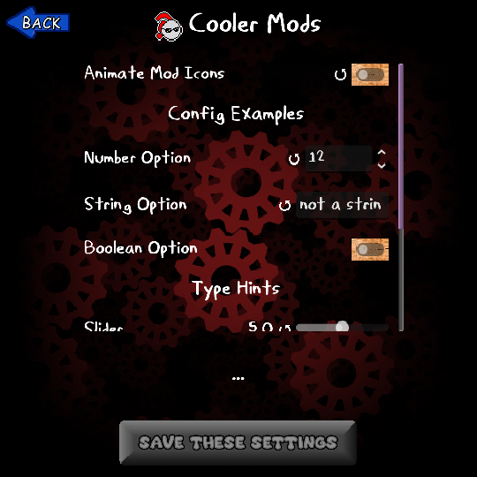

import { Aside } from '@astrojs/starlight/components';
import { FileTree } from '@astrojs/starlight/components';
import { Badge } from '@astrojs/starlight/components';
import { Tabs, TabItem } from '@astrojs/starlight/components';
import { LinkButton } from '@astrojs/starlight/components';
import { Icon } from '@astrojs/starlight/components';
import { Card } from '@astrojs/starlight/components';

<Card title="Cooler Mods" icon="seti:yml">
  Cooler Mods is a mod for Uncanny Cat Golf that makes the mod menu a lot cooler, adding things like custom mod icons, mod-exclusive configs, and more!
  
  You can download the latest version in [Cooler Mods' `#modding-forum` thread](https://discord.com/channels/1270819416954765435/1526380327520571565/1526380327520571565).
  
  If you have any issues, feel free to ask in there too!
</Card>

## File Structure
The two files Cooler Mods reads from; `coolermod.json` and `config.json`, are stored where your [mod's entry point](/getting-started/metadata/) is, which is also the path of your mod's `mod_script`.

Here's an example of what your file structure should look like, with the assumed `mod_script` value being `"res://mods/your_mod_folder/mod_script.gd"`:
<FileTree>
- mod.json
- mods
  - your_mod_folder
    - **mod_script.gd**
    - coolermod.json
    - config.json Only needed for custom mod config additions
</FileTree>

## Mod Customization
If you include a `coolermod.json` file in your mod, you can modify how your mod looks in the mod menu. The order of these tags doesn't matter.
```json
// An example coolermod.json file
// Not all values have to be added, and they can be in any order!
{
	"icon": "mods/awesome_mod/icon.png",
	"author_fancy": "[rainbow]John Uncanny",
	"name_fancy": "[font emb=1]The Awesome Mod"
}
```
:::note
- [Resources](https://docs.godotengine.org/en/4.4/classes/class_resource.html#class-resource) should end in the `.tres` file extension.
- Avoid adding `res://` before your file paths! Doing so will cause them to not load in exported builds.
:::
#### `icon`
A path to either an image file or a [`SpriteFrames`](https://docs.godotengine.org/en/4.4/classes/class_spriteframes.html) resource. This is the image that shows up in the mod menu and in your mod's config menu. If this is a `SpriteFrames`, then it will play the topmost animation.
If left blank, this is the default icon:
<center></center>
:::caution
Looping for animated icons isn't enabled by default. Make sure your `SpriteFrames` resource has looping enabled if you want your animation to loop!
:::
#### `name_fancy`
[Supports BBCode formatting](https://docs.godotengine.org/en/4.4/tutorials/ui/bbcode_in_richtextlabel.html#reference). The name that shows up when this mod is shown via Cooler Mods. Useful for modders who want to have fancier names without it looking weird for people who aren't using Cooler Mods.
#### `author_fancy`
[Supports BBCode formatting](https://docs.godotengine.org/en/4.4/tutorials/ui/bbcode_in_richtextlabel.html#reference). Same as `name_fancy`, but for the mod's author name.
#### `bg_color`
A RGBA hex code containing the colour of your mod's background in the mods menu. This value gets ignored if you have `bg_stylebox` set.

The below image uses the color `#ffd44d`:
<center></center>
#### `bg_stylebox`
A path to a [`StyleBox`](https://docs.godotengine.org/en/4.4/classes/class_stylebox.html) resource. This stylebox is applied to the background of your mod in the mods menu.
#### `description_bgcolor`
A RGBA hex code containing the colour to overlay on top of your mod's description box. This value gets ignored if you have `description_stylebox` set.

The below image uses the color `#ffd44d`:
<center></center>
#### `description_stylebox`
A path to a [`StyleBox`](https://docs.godotengine.org/en/4.4/classes/class_stylebox.html) resource. This stylebox is applied to the background of your mod's description box.

#### `config_color`
A RGB hex code that represents the colour to modulate on top of your mod's config menu. By default, this uses the same colour as the settings menu.

The below image uses the color `#ffd44d`:
<center></center>
#### `config_theme`
A path to a [`Theme`](https://docs.godotengine.org/en/4.4/classes/class_theme.html#class-theme) resource. This is applied to your mod's config menu's UI.

The below image uses the theme from "Cat Artist" (`res://assetsNEW/graphics/themes/catart.tres`):
<center></center>

### Viewing Changes
Cooler Mods allows the ability for modders to preview their changes to their `coolermod.json` or `config.json` file in their DEBUG project without needing to close and re-open the game.

To view changes:
1. Save the file / Resource you've modified.
2. Close and re-open the mods menu.

Modified `config.json` files will also need you to close and re-open the mods menu instead of just the config menu.

## Creating a Mod Config
If your mod has a `config.json` file in the same directory as your modscript, Cooler Mods will read it and parse it into a menu which can be accessed through clicking the gear icon on your mod in the mod menu. Mods that do not have a `config.json` won't have this gear icon.

**Every config option MUST have a default key!!!** This is the default option that people can reset to, and it tells Cooler Mods what value to use in case something goes wrong.
The general structure for a config option is as follows:
```json
{
  "option_id": {
    "name": "Option Name",
    "description": "Description",
    "default": "A String, number, or boolean." // or "header": 1 for headers.
  }
}
```
You can optionally add `header` as a key with any value, which will register that option as a "header". Headers will not store any information and will just act as a visual way to organize options.
<center></center>
### Type Hints
You can optionally specify a `type_hint` key in your config option. In order for a type hint to be recognized, it needs an `id` key.
```json
{
  "type_hint_option": {
    // ...
    "type_hint": {
      "id": "slider"
      // add keys as they're needed here...
    }
  }
}
```
#### Available Type Hints

#### `spin_box` <Badge text="float" variant="note" size="medium"/> 
This is the default type hint for `float` options that don't specify a type hint.

An editable text field for numbers with arrows on the side. Will only accept numbers in the range of `min` to `max` in increments of `step`.
<center></center>
| Keys | Type | Description | Default |
|:---:|---|---|:---:|
| `min` | `float` | The minimum value of this spin box. | `0` |
| `max` | `float` | The maximum value of this spin box. | `100` |
| `step` | `float` | How much this value increases by when the spin box is adjusted. | `1` |

#### `line_edit` <Badge text="String" variant="caution" size="medium"/> 
This is the default type hint for `String` options that don't specify a type hint.

An editable text line.
<center></center>

#### `checkbox` <Badge text="bool" variant="tip" size="medium"/> 
This is the default type hint for `bool` options that don't specify a type hint.

A togglable button with two states; on (`true`) and off (`false`).
<center></center>

#### `slider` <Badge text="float" variant="note" size="medium"/> 
A horizontal slider that goes from `min` to `max`. The user can adjust it by increments of `step`.
<center></center>
| Keys | Type | Description | Default |
|:---:|---|---|:---:|
| `min` | `float` | The minimum value of this slider. | `0` |
| `max` | `float` | The maximum value of this slider. | `100` |
| `step` | `float` | How much this value increases by when the slider is adjusted. | `1` |

#### `option_picker` <Badge text="float" variant="note" size="medium"/>
A button that opens a [`PopupMenu`](https://docs.godotengine.org/en/stable/classes/class_popupmenu.html), which has named options to choose from. The stored value is the **index** of the option in `options`, not the name!
<center></center>
| Keys | Type | Description | Default |
|:---:|:---:|---|:---:|
| `options` | `Array[String]` | **Required!** The names of your options. This is loaded in top-down order. | - |

### Retrieving Config Information
The saved data for your mod's config is stored in this area of the `user://` directory:
<FileTree>
- ...
- logs/
- mod_data
  - configs
    - **your_mod_id.json**
    - ...
- mods/
- ...
</FileTree>
The shorthand for your config file when reading it through a [`FileAccess`](https://docs.godotengine.org/en/4.4/classes/class_fileaccess.html#fileaccess) is `user://mod_data/configs/[mod_id].json`
The data in these files has each mod's `option_id` in your `config.json` file as a key and the current value as the value.
<Tabs>
  <TabItem label="config.json">
  ```json
  {
    "cool_option": {
      "default": "value"
    }
  }
  ```
  </TabItem>
  <TabItem label="../config/your_mod_id.json">
  ```json
  {
    "cool_option": "value"
  }
  ```
  </TabItem>
</Tabs>

<Aside type="caution" title="Don't Forget!" icon="star">
  Make sure to get the contents of the file as a `String`, and then parse it using [`JSON.parse_string()`](https://docs.godotengine.org/en/stable/classes/class_json.html#class-json-method-parse-string)!
</Aside>

At the current moment, there's not really a clean way to get new config data when your data is saved. 

<small>(i'll get around to it, trust :P)</small>

The best workaround is to refresh your config data when the `SettingsMenu` is switched to, or if you need your data on startup, you can read your data when the `GameLoader` is added to `Master`.

<center><LinkButton href="/getting-started/metadata/" icon="open-book" iconPlacement="start">
  Read about Mod Script Basics
</LinkButton></center>
