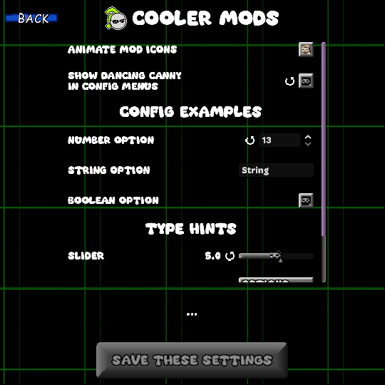

import { Aside } from '@astrojs/starlight/components';
import { FileTree } from '@astrojs/starlight/components';
import { Badge } from '@astrojs/starlight/components';
import { Tabs, TabItem } from '@astrojs/starlight/components';
import { LinkButton } from '@astrojs/starlight/components';
import { Icon } from '@astrojs/starlight/components';
import { Card } from '@astrojs/starlight/components';

<Card title="Cooler Mods" icon="seti:yml">
  Cooler Mods is a mod for Uncanny Cat Golf that makes the mod menu a lot cooler, adding things like custom mod icons, mod-exclusive configs, and more!
  
  You can download the latest version in [Cooler Mods' `#modding-forum` thread](https://discord.com/channels/1270819416954765435/1526380327520571565/1526380327520571565).
  
  If you have any issues, feel free to ask in there too!
</Card>

## File Structure
The two files Cooler Mods reads from; `coolermod.json` and `config.json`, are stored where your [mod's entry point](/getting-started/metadata/) is, which is also the path of your mod's `mod_script`.

Here's an example of what your file structure should look like, with the assumed `mod_script` value being `"res://mods/your_mod_folder/mod_script.gd"`:
<FileTree>
- mod.json
- mods
  - your_mod_folder
    - **mod_script.gd**
    - coolermod.json
    - config.json Only needed for custom mod config additions
</FileTree>

## Mod Customization
If you include a `coolermod.json` file in your mod, you can modify how your mod looks in the mod menu. The order of these tags doesn't matter.
```json
// An example coolermod.json file
// Not all values have to be added, and they can be in any order!
{
	"icon": "mods/awesome_mod/icon.png",
	"author_fancy": "[rainbow]John Uncanny",
	"name_fancy": "[font emb=1]The Awesome Mod"
}
```
:::note
- [Resources](https://docs.godotengine.org/en/4.4/classes/class_resource.html#class-resource) should end in the `.tres` file extension.
- Avoid adding `res://` before your file paths! Doing so will cause them to not load in exported builds.
:::
#### `icon`
A path to either an image file or a [`SpriteFrames`](https://docs.godotengine.org/en/4.4/classes/class_spriteframes.html) resource. This is the image that shows up in the mod menu and in your mod's config menu. If this is a `SpriteFrames`, then it will play the topmost animation.
If left blank, this is the default icon:
<center></center>
:::caution
Looping for animated icons isn't enabled by default. Make sure your `SpriteFrames` resource has looping enabled if you want your animation to loop!
:::
#### `name_fancy`
[Supports BBCode formatting](https://docs.godotengine.org/en/4.4/tutorials/ui/bbcode_in_richtextlabel.html#reference). The name that shows up when this mod is shown via Cooler Mods. Useful for modders who want to have fancier names without it looking weird for people who aren't using Cooler Mods.
#### `author_fancy`
[Supports BBCode formatting](https://docs.godotengine.org/en/4.4/tutorials/ui/bbcode_in_richtextlabel.html#reference). Same as `name_fancy`, but for the mod's author name.
#### `bg_color`
A RGBA hex code containing the colour of your mod's background in the mods menu. This value gets ignored if you have `bg_stylebox` set.

The below image uses the color `#ffd44d`:
<center></center>
#### `bg_stylebox`
A path to a [`StyleBox`](https://docs.godotengine.org/en/4.4/classes/class_stylebox.html) resource. This stylebox is applied to the background of your mod in the mods menu.
#### `description_bgcolor`
A RGBA hex code containing the colour to overlay on top of your mod's description box. This value gets ignored if you have `description_stylebox` set.

The below image uses the color `#ffd44d`:
<center></center>
#### `description_stylebox`
A path to a [`StyleBox`](https://docs.godotengine.org/en/4.4/classes/class_stylebox.html) resource. This stylebox is applied to the background of your mod's description box.

#### `config_color`
A RGB hex code that represents the colour to modulate on top of your mod's config menu. By default, this uses the same colour as the settings menu.

The below image uses the color `#ffd44d`:
<center></center>
#### `config_theme`
A path to a [`Theme`](https://docs.godotengine.org/en/4.4/classes/class_theme.html#class-theme) resource. This is applied to your mod's config menu's UI.

The below image uses the theme from "Cat Artist" (`res://assetsNEW/graphics/themes/catart.tres`):
<center></center>
#### `config_bg`
A path to a [`SpriteFrames`](https://docs.godotengine.org/en/4.4/classes/class_spriteframes.html) resource. Replaces the background of your config menu. 

The below example uses a recorded snippet of the "Endless" background as a sprite sheet:
<center></center>
:::note
- Images smaller than 512x512 will tile.
- `config_color` is still applied on top of your custom background!
:::

### Viewing Changes
Cooler Mods allows the ability for modders to preview their changes to their `coolermod.json` or `config.json` file in their DEBUG project without needing to close and re-open the game.

To view changes:
1. Save the file / Resource you've modified.
2. Close and re-open the mods menu.

:::note
Modified `config.json` files will also need you to close and re-open the mods menu instead of just the config menu.
However, adding new values to your `config.json` will require a full game restart.
:::

## Creating a Mod Config
If your mod has a `config.json` file in the same directory as your modscript, Cooler Mods will read it and parse it into a menu which can be accessed through clicking the gear icon on your mod in the mod menu. Mods that do not have a `config.json` won't have this gear icon.

**Every config option MUST have a default key!!!** This is the default option that people can reset to, and it tells Cooler Mods what value to use in case something goes wrong.
The general structure for a config option is as follows:
```json
{
  "option_id": {
    "name": "Option Name",
    "description": "Description",
    "default": "A String, number, or boolean." // or "header": 1 for headers.
  }
}
```
You can optionally add `header` as a key with any value, which will register that option as a "header". Headers will not store any information and will just act as a visual way to organize options.
<center></center>
### Type Hints
You can optionally specify a `type_hint` key in your config option. In order for a type hint to be recognized, it needs an `id` key.
```json
{
  "type_hint_option": {
    // ...
    "type_hint": {
      "id": "slider"
      // add keys as they're needed here...
    }
  }
}
```
#### Available Type Hints

#### `spin_box` <Badge text="float" variant="note" size="medium"/> 
This is the default type hint for `float` options that don't specify a type hint.

An editable text field for numbers with arrows on the side. Will only accept numbers in the range of `min` to `max` in increments of `step`.
<center></center>
| Keys | Type | Description | Default |
|:---:|---|---|:---:|
| `min` | `float` | The minimum value of this spin box. | `0` |
| `max` | `float` | The maximum value of this spin box. | `100` |
| `step` | `float` | How much this value increases by when the spin box is adjusted. | `1` |

#### `line_edit` <Badge text="String" variant="caution" size="medium"/> 
This is the default type hint for `String` options that don't specify a type hint.

An editable text line.
<center></center>

#### `checkbox` <Badge text="bool" variant="tip" size="medium"/> 
This is the default type hint for `bool` options that don't specify a type hint.

A togglable button with two states; on (`true`) and off (`false`).
<center></center>

#### `slider` <Badge text="float" variant="note" size="medium"/> 
A horizontal slider that goes from `min` to `max`. The user can adjust it by increments of `step`.
<center></center>
| Keys | Type | Description | Default |
|:---:|---|---|:---:|
| `min` | `float` | The minimum value of this slider. | `0` |
| `max` | `float` | The maximum value of this slider. | `100` |
| `step` | `float` | How much this value increases by when the slider is adjusted. | `1` |

#### `option_picker` <Badge text="float" variant="note" size="medium"/>
A button that opens a [`PopupMenu`](https://docs.godotengine.org/en/stable/classes/class_popupmenu.html), which has named options to choose from. The stored value is the **index** of the option in `options`, not the name!
<center></center>
| Keys | Type | Description | Default |
|:---:|:---:|---|:---:|
| `options` | `Array[String]` | **Required!** The names of your options. This is loaded in top-down order. | - |

### Retrieving Config Information
The saved data for your mod's config is stored in this area of the `user://` directory:
<FileTree>
- ...
- logs/
- mod_data
  - configs
    - **your_mod_id.json**
    - ...
- mods/
- ...
</FileTree>
The data in these files has each mod's `option_id` in your `config.json` file as a key and the current value as the value.
<Tabs>
  <TabItem label="config.json">
  ```json
  {
    "cool_option": {
      "default": "value"
    }
  }
  ```
  </TabItem>
  <TabItem label="../configs/your_mod_id.json">
  ```json
  {
    "cool_option": "value"
  }
  ```
  </TabItem>
</Tabs>

Cooler Mods adds a signal thats called whenever any config information is saved or adjusted. This signal is automatically hooked up to the function `_on_coolermods_config_saved()` if a modscript has it.
It also additionally calls that function specifically to your modscript on hookup, so you can safely get your config's save data as soon as possible.
```gdscript
# This is called for EVERY config file thats saved, not just your mod's config data!
func _on_coolermods_config_saved(mod: ModLoader.Mod, data: Dictionary):
  # To check for your own info, you can do:
  if mod.id == MOD_ID: # where MOD_ID is a variable of your mod's ID.
    pass
```
<center><LinkButton href="/guides/modscript_basics/" icon="open-book" iconPlacement="start">
  Read about Mod Script Basics
</LinkButton></center>

## `CoolerMods` Codes & Nodes Reference
In some cases, mods might need to get access to some code or nodes that Cooler Mods uses. Cooler Mods' modscript, which will be referred to as `CoolerMods`, has a few things to help streamline this.
This creates a bit of a scenario where mods will need to seek out and save a reference of `CoolerMods`, but as a Node child of `ModLoader`.

To get an instance of `CoolerMods` as a Node, you can use the following code:
```gdscript
var cm = get_tree().root.get_node("ModLoader/justsomejello_coolermods")
```
### Signals
With the actual Node instance of Cooler Mods' modscript, you can hook up signals from `CoolerMods` to your own modscript, which can be used for cross-mod communication regarding new Nodes and data.
```gdscript
# eg. (cm is a Node instance of CoolerMods)
cm.config_option_value_changed.connect(my_own_function)
```
:::caution
Make sure that the functions you hook up to signals from `CoolerMods` match the parameters of the signal you're connecting!
:::
#### `config_saved(mod: ModLoader.Mod, data: Dictionary)`
Emitted whenever any mod's config data is saved, such as pressing the "Save My Settings" button in a mod config menu.

| Parameters | Type | Description |
|---|---|---|
| `mod` | `ModLoader.Mod` | The mod this config's data is associated with. |
| `data` | `Dictionary` | The save data of the config. This is equal to the parsed file contents of `../configs/[mod.id].json`. |
:::caution
`CoolerMods` automatically hooks up this signal to any functions called `_on_coolermods_config_saved()` in any currently loaded modscript.
It's not recommended to manually hook up to this signal as the startup signal call on `GameLoader._enter_tree()` will not go through!
:::

#### `config_option_value_changed(mod: ModLoader.Mod, id: String, value: Variant)`
Emitted whenever any option in any config value is changed. This does not include initial value changes when loading the config menu.

| Parameters | Type | Description |
|---|---|---|
| `mod` | `ModLoader.Mod` | The mod this config option is associated with. |
| `id` | `String` | The option ID of the currently adjusted value. |
| `value` | `Variant` | The new value of the option. |

#### `config_menu_post_ready(mod: ModLoader.Mod, menu: Menu)`
Emitted after a config menu has been switched to and loaded.

| Parameters | Type | Description |
|---|---|---|
| `mod` | `ModLoader.Mod` | The mod this config menu is associated with. |
| `menu` | `Menu` | A reference to the current config menu.<br></br>[See `ModConfigMenu`](#modconfigmenu). |

#### `mods_menu_post_ready(menu: Menu)`
Emitted after the mods menu has been switched to.

| Parameters | Type | Description |
|---|---|---|
| `menu` | `Menu` | A reference to the current mods menu.<br></br>[See `CoolerModsMenu`](#coolermodsmenu). |

#### `mod_button_post_ready(mod: ModLoader.Mod, button)`
Emitted after a `CoolerModButton` has been added to either "Available" or "Enabled".

| Parameters | Type | Description |
|---|---|---|
| `mod` | `ModLoader.Mod` | The mod this mod button is associated with. |
| `button` | `Control` | A reference to the current mod button.<br></br>[See `CoolerModButton`](#coolermodbutton). |

### `ModConfigMenu`
`extends Menu`

A menu that reads info from a mod's `config.json` file and parses it into a menu.

The names of the children of `config_elements` match the option ID they represent.

| Properties | Type | Description |
|---|---|---|
| `background` | `AnimatedSprite2D` | The background of the config menu. |
| `config_elements` | `Control` | A `Control` containing every loaded config option as a child. |
| `config_info` | `Dictionary` | The parsed data of `mod`'s `config.json`. This is NOT the saved config data of `mod`, only the UI information and default values! |
| `description` | `Label` | The text box at the bottom of the screen. The text changes based on which option is currently hovered over. |
| `header` | `Label` | The title of the config menu, which is usually `mod.name`. |
| `header_icon` | `TextureRect` | The icon beside the header. Uses the same texture as your `icon` in `coolermod.json`. |
| `mod` | `ModLoader.Mod` | The mod this config menu is associated with. |
| `save_button` | `Button` | The button at the very bottom of the menu. When pressed, `CoolerMods.config_saved` is emitted. |
| `ui` | `Control` | The topmost node of all config menu-exclusive elements. The background and back button aren't included in this. |
| `_bg_viewport` | `SubViewport` | A Viewport used for generating the texture of the background. Used to allow tiling support for config backgrounds. |

### `CoolerModButton`
`extends PanelContainer`

An alternative `ModButton` that has a lot more style to it. Used exclusively by `CoolerModsMenu`.

| Properties | Type | Description |
|---|---|---|
| `mod` | `ModLoader.Mod` | The mod this ModButton is tied to. |
| `_author` | `RichTextLabel` | Author name. |
| `_config_button` | `Control` | The gears button. Opens a `ModConfigMenu` when pressed. |
| `_content` | `Container` | The container with all of the mod button's visual info. |
| `_description` | `RichTextLabel` | Mod description. |
| `_description_bg` | `PanelContainer` | The background of the mod description. |
| `_disable_button` | `Button` | The button that moves mods back to "Available". |
| `_enable_button` | `Button` | The button that moves mods to "Enabled". |
| `_icon` | `TextureRect` | Mod icon. |
| `_mod_bg` | `PanelContainer` | The background of the mod button.  |
| `_name` | `RichTextLabel` | Mod name. |
| `_order_buttons` | `Control` | Contains `OrderUp` and `OrderDown`; two buttons that re-order mods in "Enabled". |
| `_viewport` | `SubViewport` | A viewport. If a mod has an animated icon, `_viewport`'s texture is used instead of loading an image file. The size of the viewport is adjusted to be the size of the first frame in the animated icon. |
| `_viewport_icon` | `AnimatedSprite2D` | A blank animated sprite. The `SpriteFrames` are only set if a mod has an animated icon. |

### `CoolerModsMenu`
`extends Menu`

The mods menu, made a lot cooler. This is loaded instead of the base game's mod menu when Cooler Mods is enabled.

| Properties | Type | Description |
|---|---|---|
| `_activation_toggle` | `CheckButton` | The "Mods Enabled" button. |
| `_background` | `AnimatedSprite2D` | The background of the mods menu. |
| `_disabled_mods` | `Control` | A container that has every other `CoolerModButton` that isn't enabled. |
| `_enabled_mods` | `Control` | A container with every currently enabled `CoolerModButton`. |
| `_music_player` | `AudioStreamPlayer` | Plays the mods menu music. The current song set in `Master` is none to prevent overlapping. |